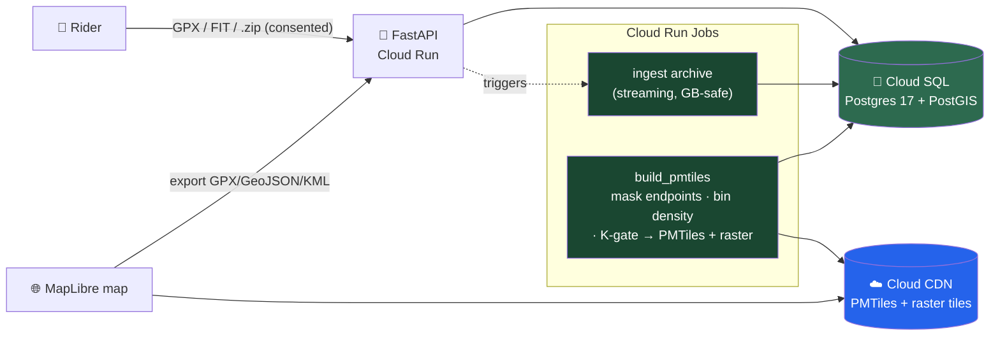

<p align="center">
  
</p>

<h1 align="center">CHEMINS COMMUNS</h1>

<p align="center">
  <strong><em>Cartographier ensemble, pédaler librement.</em></strong><br>
  The open-source community cycling heatmap — import your rides, build a shared map of the
  paths people actually ride, and export it into the routing tool of your choice.
</p>

<p align="center">
  <a href="https://github.com/polomarcus/common-trails/actions/workflows/ci.yml"></a>
  <a href="LICENSE"></a>
  <a href="https://opendatacommons.org/licenses/odbl/"></a>
  
  
  
</p>

<p align="center">
  <a href="#-why">Why</a> ·
  <a href="#-what-it-does">Features</a> ·
  <a href="#-quick-start">Quick start</a> ·
  <a href="#%EF%B8%8F-how-it-works">How it works</a> ·
  <a href="#-contributing">Contributing</a> ·
  <a href="docs/">Docs</a>
</p>

---

## 🌍 Why

Strava popularised the **heatmap** — a map that colours paths by how many cyclists actually
ride them — then locked it behind a subscription. The underlying signal, though, comes from
riders' own GPS traces.

**Chemins Communs rebuilds that heatmap as an open commons.** You import your own rides; they
enrich a shared, openly-licensed popularity map (ODbL 1.0); and you export the result — the
raw, precise traces — into whatever router you already trust (gpx.studio, BRouter,
GraphHopper…). The project's job is to be the **open heatmap and trace source**, not to be yet
another routing engine — the ecosystem already routes better than we could.

> **What we believe** — mapping is a commons · your traces are yours · the shared data is
> public, auditable and re-usable.
>
> **What we refuse** — scraping private APIs · importing proprietary heatmaps · sharing without
> explicit consent · opaque centralisation of community data.

---

## ✨ What it does

### 🔥 Community heatmap (raw traces, law of large numbers)
Every consented upload draws its precise GPS polyline onto a shared map. Where many riders
overlap, the line grows hot — the Strava-heatmap look, openly licensed. Rendered as static
[PMTiles](https://protomaps.com/) + a raster tile pyramid, served from a CDN.

### 📥 One-drop import
Drag a GPX, a FIT file, or a whole Strava/Garmin export `.zip` onto a single dropzone — the
app routes small files through the direct path and big archives through a streaming,
GB-safe archive pipeline. Sport is classified automatically; out-of-scope activities
(indoor, virtual, swim…) are skipped rather than mis-mapped.

### 🔒 Privacy by construction
Only activities you **explicitly upload and consent to share** feed the community layer
(traces pulled via a platform API stay personal-only). Trace **endpoints are masked**
(`TRACE_MASK_METERS`, ~200 m) to protect home/work, the map is login-gated, and a per-cell
**distinct-user threshold** (`HEATMAP_MIN_USERS`) hides sparsely-ridden pixels.

### 🧭 Export to your router
Export the community heatmap or your own activities as **GPX / GeoJSON / KML**, or add the
live heatmap as a **map overlay** in gpx.studio / VisuGPX / any MapLibre app via a standard
raster XYZ tile URL.

### 📊 Personal stats
Distance, elevation, activity count, per-sport breakdown and personal records for your own
history — computed from your activities, never from the shared layer.

> **Status.** The maintained product is the import → heatmap → export loop above. Earlier
> experiments that shipped in git history — an in-browser WASM router and a GitHub-style
> route fork/PR model — are **retired/frozen** and not part of the current app.

---

## ⚡ Quick start

```bash
git clone https://github.com/polomarcus/common-trails.git
cd common-trails
make up
```

Then open **http://localhost:3787** — a demo account is seeded automatically:

| Email | Password |
|-------|----------|
| `admin@admin` | `admin` |

Backend: **http://localhost:8787** · Postgres: **localhost:5487**

> **Prerequisites**: Docker + Make. Node 20+ only to develop the frontend outside Docker.
> Copy `cp .env.example .env` for the dev defaults (`TEST_MODE=true`, `HEATMAP_MIN_USERS=1`).

---

## 🏗️ How it works



Your uploaded activities stay **private**; only the derived, endpoint-masked, K-gated
popularity layer is published. The heatmap is built by streaming over consented activities
with **bounded memory** (peak RAM scales with occupied geography, not ride count), so it runs
on a small instance.

```
┌──────────────────────────────────────────────┐
│  PRIVATE — never published                     │
│  activities · OAuth tokens · your raw uploads  │
└───────────────────────┬────────────────────────┘
        endpoint-masking + consent + K-anonymity gate
                        ▼
┌──────────────────────────────────────────────┐
│  COMMONS — Open Database Licence 1.0           │
│  the popularity heatmap · exports              │
└──────────────────────────────────────────────┘
```

> **K-anonymity.** `HEATMAP_MIN_USERS=1` shows every consented trace (used during the invited
> beta); set it to `2` to hide any pixel ridden by a single user before a wide public launch.

🔬 Deep dives live in [`docs/`](docs/) — ingestion pipeline, heatmap build, deploy doctrine.

---

## 🧪 Stack

| Layer | Tech |
|---|---|
| Frontend | Next.js 16 (static export) · TypeScript · MapLibre GL 4 · PMTiles |
| Backend | FastAPI · Python 3.13 · SQLAlchemy · Alembic |
| Database | PostgreSQL 17 · PostGIS 3.6 |
| Tests | pytest (backend) · Vitest (frontend) · Playwright (E2E) |
| Infra | GCP serverless — Cloud Run · Cloud SQL · Cloud Storage · Cloud CDN |

### Key configuration

| Variable | Dev default | Purpose |
|---|---|---|
| `TEST_MODE` | `true` | Stubs all external calls |
| `HEATMAP_DISPLAY_SOURCE` | `raw` | Raw-trace heatmap (vs. legacy matched) |
| `HEATMAP_MIN_USERS` | `1` | Per-cell distinct-user floor (K-anonymity) |
| `TRACE_MASK_METERS` | `200` | Endpoint masking radius |
| `JWT_EXPIRE_MINUTES` | `10080` (7 d) | Session lifetime |

---

## 🤝 Contributing

Contributions are welcome — a bug fix, a new region, better cartography, docs.

```bash
git checkout -b feat/<slug>        # never commit on main
# … change code …
docker compose exec backend pytest -q          # backend
cd frontend && npm run build && npx tsc --noEmit  # frontend build + types
ruff check backend/                             # Python lint
git commit -s -m "feat: <what>"                 # -s = Developer Certificate of Origin
gh pr create --base main
```

House rules: **never push to `main`**, open a PR and **squash-merge**, and ship a
non-regression test with every bug fix (UI fixes get a Playwright spec or an explicit
manual-smoke note). See [`docs/`](docs/) for the local-testing guide and deploy doctrine.

---

## 📜 Licence

Deliberate dual-license:

- **Source code** — [GNU Affero General Public License v3.0 (AGPL-3.0)](LICENSE)
- **Community data** (the heatmap, exports) — [Open Database Licence 1.0 (ODbL)](https://opendatacommons.org/licenses/odbl/)

**Why AGPL?** It closes the *SaaS loophole* of plain GPL: if anyone takes this code, modifies
it and runs it as an online service, they must publish their modifications under the same
licence. Contribute, fork, self-host, sell support — all allowed; run a closed modified SaaS —
not allowed. Same choice as Mastodon, Plausible, Grafana, Nextcloud.

Your personal activities and OAuth tokens stay **private** and are never published without
explicit opt-in. By submitting a PR you agree your contribution is published under AGPL-3.0
(code) and, where it includes commons data, under ODbL-1.0 — materialised by a
`Signed-off-by` line (`git commit -s`, Developer Certificate of Origin). No CLA.

---

<p align="center">
  <sub>Construit en France · for the Cévennes, the Mercantour, the Alps, and every path we share.</sub>
</p>
