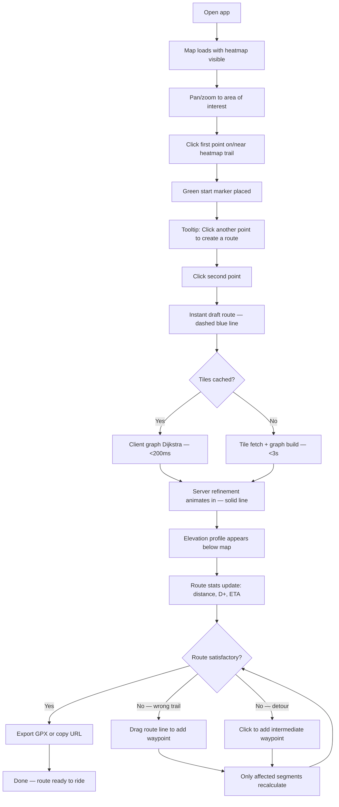
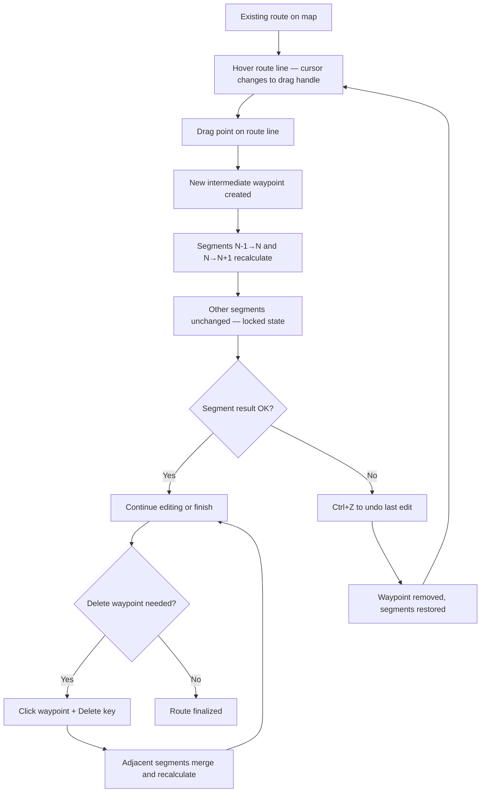
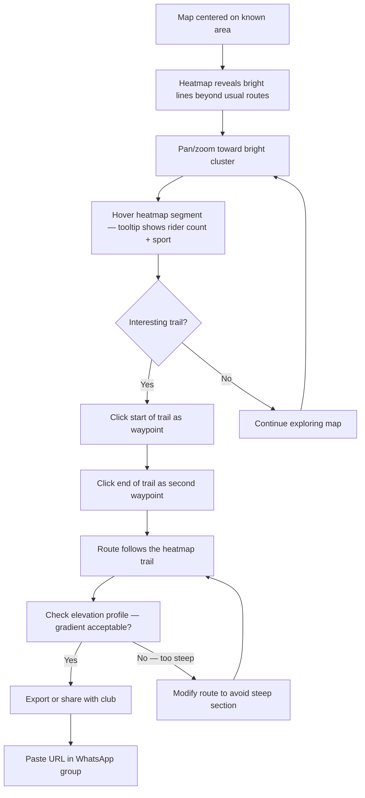
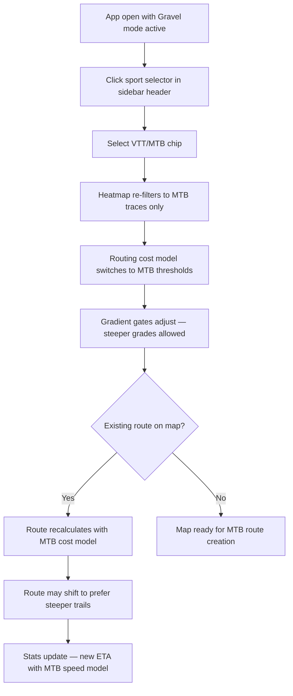

# UX Design Specification Common Trails

**Author:** Paulleclercq
**Date:** 2026-03-14

---

<!-- UX design content will be appended sequentially through collaborative workflow steps -->

## Executive Summary

### Project Vision

Common Trails is a map-first off-road route planner for gravel, MTB, and bikepacking riders in France. It differentiates from Komoot/Strava by blending community heatmaps, official trail networks (GR/GT/PR/DFCI), and gradient-aware terrain intelligence into a single routing engine. The core promise: routes follow where people actually ride, not where the map says roads exist.

The product is a static SPA (Next.js + MapLibre GL) with interactions modeled after Strava/Komoot/Google Maps — click to add waypoints, drag to modify, instant recalculation.

### Target Users

**Primary: Off-road cyclists in the Hérault (France)**

1. **Léa (Gravel rider)** — Plans bikepacking loops in the Cevennes. Frustrated by Komoot ignoring trails she can see on the heatmap. Wants to discover new routes, not micromanage waypoints. Tech-savvy, uses phone at trailhead and laptop at home.

2. **Nico (Club MTB rider)** — Plans group rides for his 40-person club near Montpellier. Needs fast route creation (< 5 min for 25km), URL sharing for the WhatsApp group, no paywall. Multiple club members importing Strava traces = rich local heatmap.

3. **Paul (Admin)** — Solo developer, monitors routing quality and import health. Needs Sentry dashboards, E2E test suite, config-level tuning.

**User context:** Route planning happens both on laptop (evening planning) and phone (at the car park, at the trailhead). Users are active cyclists who understand elevation profiles, sport types, and trail terminology. They will invest 5-10 minutes in route planning if the result is trustworthy.

### Key Design Challenges

1. **Routing trust gap** — The #1 UX problem is trust. The routing engine produces routes that ignore heatmap trails and create absurd detours. UX must communicate when routing uses heatmap vs fallback (draft-then-refine pattern).

2. **Sport filter discoverability** — Sport filter exists but is at the bottom of the layers panel, visually disconnected from the heatmap toggle it controls. Needs to be nested under the heatmap layer.

3. **Layers panel cognitive overload** — Too many toggles visible by default. Needs progressive disclosure: 3 essential layers + "More."

4. **Mobile route planning** — Route planning often happens on phone. Touch interactions must work with 44x44px targets. Sidebar must collapse to maximize map real estate.

5. **Color blindness accessibility** — Heatmap and elevation profile are unreadable for deuteranopia/protanopia. Needs brightness/luminance encoding alongside color.

### Design Opportunities

1. **Heatmap as onboarding** — The heatmap is self-explanatory (brighter = more riders). One tooltip replaces an onboarding tutorial. The heatmap IS the killer feature.

2. **Draft-then-refine visual pattern** — Show instant draft route, then animate server refinement. Fast feedback + trust-building. Komoot doesn't do this.

3. **Signal confidence visualization** — Segments where heatmap + GR + DFCI converge could be visually distinct from single-signal segments. Communicates routing quality without words.

## Core User Experience

### Defining Experience

**The ONE thing:** Placing two waypoints on the map and getting a route that follows trails real cyclists have ridden — in under one second.

Everything else (layers, sport filter, elevation, export) serves this core action. If the route between waypoints follows the heatmap + GR/DFCI trails correctly and instantly, the product works. If it doesn't, nothing else matters.

**The core loop:** Navigate map → see heatmap → place waypoints → get trustworthy route → refine with drags → export/share.

### Platform Strategy

- **Web SPA** (Next.js static export + MapLibre GL) — no native app for V1
- **Desktop (primary):** Evening route planning with mouse — click to add, drag to modify, keyboard shortcuts
- **Mobile browser (secondary):** Trailhead/car park planning with touch — tap to add, long-press to drag, 44x44px touch targets
- **Responsive:** Collapsible sidebar (36px collapsed / 260px expanded) maximizes map on mobile
- **Offline:** Not in V1, but architecture doesn't prevent future PWA/service worker tile caching
- **No SSR:** Static export, CDN-served, SPA routing via serve.py

### Effortless Interactions

1. **Waypoint to Route (instant):** Place a waypoint, route appears immediately using cached tiles. No loading spinner for cached areas. The Komoot benchmark: route visible before your finger lifts.

2. **Sport selection adapts everything:** Select "Gravel" once, and heatmap filters, routing cost model, and gradient thresholds all switch. No separate settings for each.

3. **Heatmap discovery (zero learning):** Bright lines on the map = popular trails. No tutorial needed. One tooltip on first visit: "Brighter = more riders."

4. **GPX export (one click):** Route done, export button, GPX downloads. No format options, no intermediate screens.

5. **URL sharing (zero friction):** Route exists, copy URL, paste in WhatsApp. Recipient sees the route without login.

### Critical Success Moments

1. **"It follows the trail!"** — First time the router follows a GR/heatmap trail instead of a road. This is the moment the rider trusts Common Trails over Komoot. If this doesn't happen on the first route, the user is lost.

2. **"I didn't know that trail existed"** — Rider spots a bright heatmap line near their usual loop. The heatmap reveals discovery value. This is the hook for repeat use.

3. **"That was fast"** — Drag a waypoint, route recalculates in under a second. Per-segment recalc means only the affected segments change. The rest of the route stays locked. No whack-a-mole.

4. **"It just works on my phone"** — Trailhead planning on phone: tap two points, get a route, export GPX. No pinch-zoom disasters, no tiny buttons, no broken sidebar.

### Experience Principles

1. **Map-first** — The map IS the interface. Minimize chrome, maximize map. Every panel collapses. Every action happens on the map.

2. **Trust through transparency** — Show the routing method badge (heatmap / smart / fallback). Show draft-then-refine animation. Show signal confidence on route segments. The rider should always know WHY the route goes where it does.

3. **Speed is UX** — <1s recalculation, 100ms visual feedback, instant draft routes. A 3-second delay on every edit makes a 20km route take 10 minutes instead of 3. Performance IS the feature.

4. **Progressive disclosure** — 3 layers by default, more behind toggle. Sport filter nested under heatmap. Advanced features hidden until needed. Simple by default, powerful on demand.

5. **Discovery over planning** — The heatmap reveals trails you didn't know existed. The app proposes routes, not just computes them. Common Trails is a trail discovery engine that happens to have a route planner.

## Desired Emotional Response

### Primary Emotional Goals

**Confidence** — "I trust this route." The rider places two waypoints and the route follows the GR trail they can see on the heatmap. No second-guessing, no cross-referencing with Komoot or IGN Rando.

**Discovery excitement** — "I didn't know that trail existed!" The heatmap reveals a bright line 2km from the rider's usual loop. 47 gravel riders this month. This feeling is the emotional hook that brings riders back.

**Flow state** — "Route planning feels effortless." Drag a waypoint, route updates instantly, move to the next section. No waiting, no broken recalculations, no whack-a-mole.

### Emotional Journey Mapping

| Stage | Desired Emotion | Anti-Emotion to Prevent |
|-------|----------------|------------------------|
| First visit | Curiosity ("what are those bright lines?") | Confusion ("what am I looking at?") |
| First route | Trust ("it follows the trail!") | Skepticism ("another app that routes on roads") |
| Route editing | Flow ("this is fast and responsive") | Frustration ("editing one section broke another") |
| Discovering a trail | Excitement ("I need to ride this") | Indifference ("just another map") |
| Exporting/sharing | Satisfaction ("done, ready to ride") | Anxiety ("did the export work?") |
| Returning to app | Familiarity ("I know exactly where to click") | Relearning ("where was that button?") |

### Micro-Emotions

- **Confidence > Skepticism** — Routing method badge and draft-then-refine animation build confidence. The rider sees the system working, not guessing.
- **Excitement > Anxiety** — Discovering new trails should feel exciting. Signal stacking visual (triple-confirmed segments) reduces uncertainty.
- **Accomplishment > Frustration** — Finishing a route in 3 minutes instead of 10 creates mastery. Per-segment recalc eliminates cascade frustration.
- **Trust > Doubt** — One absurd detour destroys trust. Zero detours on the first 3 routes establishes it. Trust is binary — earned slowly, lost instantly.

### Design Implications

| Emotion | UX Design Approach |
|---------|-------------------|
| Confidence | Routing method badge on each segment. Draft route appears instantly, refined route animates in. |
| Discovery | Heatmap always visible by default. Bright = inviting. Hover reveals rider count. |
| Flow | <1s recalculation. Optimistic rendering. No modal dialogs during editing. No confirmation for reversible actions. |
| Trust | No absurd detours (quality gate). Route prefers known trails. Fallback is transparent. |
| Accomplishment | Route stats update live. Export is one click. Share is copy URL. |

### Emotional Design Principles

1. **Earn trust in the first 30 seconds** — The first route must follow trails. If it routes on a road next to a visible heatmap trail, trust is lost permanently.

2. **Reward curiosity** — Every heatmap hover, every zoom, every pan should reveal something interesting. The map should feel alive with data.

3. **Eliminate waiting anxiety** — Never show a spinner without context. If tiles are loading: "Loading trail data..." If routing: instant draft visible.

4. **Make errors recoverable, not punishing** — Ctrl+Z works. Deleting a waypoint recalculates. Dragging is reversible. No destructive actions without confirmation.

5. **Celebrate completion quietly** — No confetti, no popups. Route complete, stats visible, export ready. The satisfaction comes from the route itself.

## UX Pattern Analysis & Inspiration

### Inspiring Products

#### Komoot (Route Editing Benchmark)
- **What works:** Click-to-add waypoints, drag-to-modify, instant per-segment recalculation. Route line is always visible, never disappears during edits. Elevation profile stays synchronized with route.
- **What to learn:** Their 3-minute route creation benchmark. Per-segment state isolation means editing one section never breaks another.
- **What to improve on:** Komoot routes theoretically (OSM roads), not empirically (where people ride). No heatmap integration. Sport filter doesn't affect routing cost model deeply enough.

#### Strava (Heatmap Encoding)
- **What works:** Global heatmap with brightness = volume. Instantly readable. No legend needed. Zoom reveals finer detail.
- **What to learn:** Luminance-based encoding works across color blindness types. The heatmap is self-explanatory — the encoding IS the tutorial.
- **What to improve on:** Strava heatmap is view-only, never routable. No sport filtering on the public heatmap. No segment-level stats on hover.

#### Google Maps (Click/Drag Interaction Model)
- **What works:** Click to place, drag to adjust. Right-click context menus. Instant feedback on every interaction. Universal mental model — every user already knows how this works.
- **What to learn:** The interaction model is so standard it's invisible. Users don't "learn" Google Maps, they just use it. Common Trails should feel identical for basic interactions.
- **What to avoid:** Google Maps' cycling directions are road-biased and untrustworthy for off-road. Their routing confidence is opaque.

#### IGN Rando (Trail Data Authority)
- **What works:** Authoritative GR/PR/GT trail data with named routes, difficulty ratings, official markings. Trusted by hikers and trail runners in France.
- **What to learn:** Trail naming and official network visualization. Users trust IGN for trail existence, even if the routing is poor.
- **What to improve on:** Terrible routing engine. No community data. Slow, cluttered interface. No elevation-aware routing.

### Transferable UX Patterns

**Navigation patterns:**
- Map-centric layout with collapsible panels (Google Maps, Komoot)
- Sport/activity selector as global mode switch (Komoot, Strava)
- Layers panel with toggles for data overlays (all mapping apps)

**Interaction patterns:**
- Click-to-add, drag-to-modify waypoints (Komoot, Google Maps)
- Per-segment recalculation on edit (Komoot)
- Elevation profile synchronized with route hover (Komoot, Strava)
- Right-click context menu for waypoint actions (Google Maps)

**Visual patterns:**
- Luminance-based heatmap encoding (Strava)
- Route line with method/confidence differentiation (novel to Common Trails)
- Draft-then-refine animation for routing feedback (novel to Common Trails)
- Slope-gradient coloring on elevation profile (existing in Common Trails)

### Anti-Patterns to Avoid

1. **Komoot's paywall on map layers** — Common Trails is open source. All layers are free. Never gate data behind payment.
2. **Strava's non-routable heatmap** — The heatmap must be routable. View-only heatmaps frustrate users who can see trails but can't route on them.
3. **IGN Rando's cluttered interface** — Too many controls visible by default. Progressive disclosure prevents overwhelm.
4. **Google Maps' opaque routing** — Never hide the routing method. Users need to know WHY the route goes where it does.

### Design Inspiration Strategy

| Category | Adopt | Adapt | Avoid |
|----------|-------|-------|-------|
| Interaction | Google Maps click/drag | Komoot per-segment recalc | IGN Rando's sluggish interactions |
| Visual encoding | Strava luminance heatmap | Komoot elevation profile | Strava's non-filterable heatmap |
| Layout | Google Maps map-centric | Komoot collapsible sidebar | IGN Rando's cluttered panels |
| Trust signals | (novel) method badges | Komoot sport adaptation | Google Maps' opaque routing |
| Data layers | IGN trail authority | Strava social proof | Komoot's paywalled layers |

## Design System Foundation

### Design System Choice

**Approach: Minimal Custom + Tailwind CSS (utility-first)**

Common Trails is a map-first SPA where the map IS the interface. There is no traditional dashboard, form-heavy admin, or content-driven layout that would benefit from a component library like MUI or Chakra. The UI chrome is minimal:
- A collapsible sidebar (36px / 260px)
- A layers panel with toggles
- An elevation profile SVG
- Route stats bar
- Sport selector chips
- Waypoint context menus

### Rationale for Selection

1. **Map dominance (90%+ viewport)** — Component libraries add weight (MUI ~80KB gzipped) for components that won't be used. The map viewport is MapLibre GL, not React components.
2. **Solo developer** — Paul doesn't need design system governance, component documentation, or cross-team consistency tooling. Tailwind utilities are faster for one person.
3. **Existing codebase** — The app already uses inline styles and minimal CSS. Tailwind is additive, not a rewrite.
4. **Performance = UX** — Every KB matters when the core promise is <1s interactions. No component library overhead.
5. **Static export** — Next.js static export + Tailwind purges unused CSS to near-zero. Component libraries often fight tree-shaking.

### Implementation Approach

- **Tailwind CSS** for all layout, spacing, color, typography, responsive breakpoints
- **CSS custom properties** for design tokens (colors, spacing, shadows) that Tailwind references
- **MapLibre GL built-in controls** for map-specific UI (attribution, zoom, compass)
- **Custom React components** only for: sidebar, layers panel, elevation profile, route stats, sport selector
- **No component library** — the UI surface is too small and too map-specific to justify one

### Customization Strategy

- **Design tokens** defined as CSS custom properties: `--color-route-draft`, `--color-route-refined`, `--color-heatmap-low`, `--color-heatmap-high`, `--color-signal-triple`
- **Dark map, light panels** — Map tiles are dark terrain; sidebar/panels use light backgrounds with high contrast
- **Touch-first sizing** — All interactive elements minimum 44x44px, enforced via Tailwind's `min-w-11 min-h-11`
- **Color-blind safe palette** — Heatmap and route colors tested against deuteranopia/protanopia simulations; luminance encoding as primary channel, hue as secondary

## Defining Core Experience

### The Defining Experience

**"Drop two points, ride the trail."**

Common Trails' defining interaction: tap/click two points on the map and get a route that follows trails real cyclists have ridden — visible on the heatmap — in under one second.

This is what users will tell their riding buddies: *"There's this app where you just click two points and it routes on the actual trails, not the roads."*

### User Mental Model

**How users currently solve this:** Komoot or Strava route builder. Place waypoints, get a road-biased route, then spend 7+ minutes dragging waypoints every 200m to force the route onto trails they can see on satellite/heatmap.

**Mental model they bring:** Google Maps directions — click A, click B, get a route. They expect the route to be smart about WHERE it goes, not just the shortest path.

**Where they get confused:** When the heatmap shows a bright trail 50m from the computed route, but the router ignores it. The visual data contradicts the routing output. This breaks trust instantly.

**What they love about existing tools:** Komoot's drag-to-refine speed. Strava's heatmap coverage. IGN Rando's trail authority.

**What they hate:** Komoot ignores community trails. Strava's heatmap isn't routable. IGN Rando's routing is terrible. No tool combines all three signals.

### Success Criteria

| Criterion | Target | Measurement |
|-----------|--------|-------------|
| Route follows heatmap trails | >80% of route on heatmap/DFCI/GR edges | Visual overlap check |
| Route appears instantly | <1s for cached tiles, <3s for uncached | Time-to-route metric |
| Zero absurd detours | 0 loops/U-turns on first 3 routes | Manual quality gate |
| Route creation time | <5 min for 25km route | User timing benchmark |
| One-click export | GPX downloads in 1 click | Interaction count |
| Per-segment editing | Editing segment N doesn't affect segments 1..N-1 | Regression test |

### Novel vs. Established Patterns

**Established (adopt as-is):**
- Click-to-add waypoints (Google Maps/Komoot)
- Drag-to-modify route segments (Komoot)
- Collapsible sidebar for route details (Komoot/Google Maps)
- Elevation profile synchronized with route (Komoot/Strava)

**Novel (Common Trails innovations):**
- **Draft-then-refine animation** — Instant client-side draft route (dashed, translucent), then server-refined route animates in (solid, opaque). User sees the system working, building confidence.
- **Routing method badge** — Each segment shows its routing source: `heatmap` / `DFCI` / `GR` / `smart` / `fallback`. Transparency builds trust.
- **Signal confidence encoding** — Triple-confirmed segments (heatmap + GR + DFCI) are visually thicker/brighter than single-signal segments. No words needed.
- **Sport-aware everything** — Selecting a sport changes heatmap filter, routing cost model, gradient thresholds, and ETA calculation simultaneously. One control, four effects.

### Experience Mechanics

**1. Initiation:**
- User sees the map with heatmap visible by default. Bright lines invite exploration.
- User clicks/taps a point on or near a heatmap trail — first waypoint placed (green marker).
- Tooltip: "Click another point to create a route."

**2. Interaction:**
- User clicks/taps a second point — instant draft route appears (dashed blue line, client-graph Dijkstra).
- Within 500ms-2s, server-refined route animates in (solid line, replacing draft). Color reflects routing method.
- Elevation profile appears below the map, synchronized with route.
- Route stats update live: distance, elevation gain/loss, estimated time.

**3. Feedback:**
- **Draft visible immediately** — no spinner, no waiting. The system is responsive.
- **Routing method badges** on hover/tap — user sees WHY the route goes where it does.
- **Signal confidence** — thicker line on triple-confirmed segments communicates "this part is very trustworthy."
- **Error recovery** — Ctrl+Z undoes last waypoint. Delete key removes selected waypoint and recalculates.
- **Drag refinement** — Drag any point on the route line to add an intermediate waypoint. Only affected segments recalculate.

**4. Completion:**
- Route stats bar shows: distance, elevation +/-, estimated time, sport mode.
- Export button (top-right of stats bar) — one click — GPX downloads.
- Share button — copies URL to clipboard. Toast: "Link copied."
- Route persists in URL state — refreshing the page restores the route.

## Visual Design Foundation

### Color System

**Map context:** The map fills 90%+ of the viewport with dark terrain tiles (OpenMapTiles/Mapbox dark style). All UI colors must work against both the dark map AND light panel backgrounds.

**Semantic Color Tokens:**

| Token | Hex | Usage |
|-------|-----|-------|
| `--color-route-draft` | `#60A5FA` (blue-400) | Draft route line (dashed, 50% opacity) |
| `--color-route-refined` | `#3B82F6` (blue-500) | Refined route line (solid) |
| `--color-route-fallback` | `#F59E0B` (amber-500) | Fallback/OSM-only segments |
| `--color-heatmap-low` | `#1E3A5F` (dark blue) | Low rider count (faint) |
| `--color-heatmap-high` | `#F97316` (orange-500) | High rider count (bright) |
| `--color-signal-triple` | `#22C55E` (green-500) | Triple-confirmed segments (heatmap+GR+DFCI) |
| `--color-waypoint` | `#10B981` (emerald-500) | Waypoint markers |
| `--color-waypoint-start` | `#22C55E` (green-500) | Start marker |
| `--color-waypoint-end` | `#EF4444` (red-500) | End marker |
| `--color-panel-bg` | `#FFFFFF` | Panel/sidebar background |
| `--color-panel-text` | `#1F2937` (gray-800) | Panel text |
| `--color-panel-muted` | `#6B7280` (gray-500) | Secondary text |
| `--color-error` | `#EF4444` (red-500) | Error states |
| `--color-success` | `#22C55E` (green-500) | Success feedback |

**Heatmap gradient:** Dark blue to orange to white (luminance ramp). Color-blind safe because it relies on brightness, not hue distinction. Deuteranopia/protanopia users see the luminance gradient clearly.

**Elevation profile gradient:** Green (0-5%) to yellow (5-10%) to orange (10-15%) to red (15-20%) to purple (>20%). Already implemented — preserving existing convention.

### Typography System

**Approach:** System font stack — zero network requests, instant rendering, native platform feel.

```
--font-sans: -apple-system, BlinkMacSystemFont, "Segoe UI", Roboto, sans-serif;
--font-mono: ui-monospace, "Cascadia Code", "Fira Code", monospace;
```

**Type scale (4px base, 1.25 ratio):**

| Level | Size | Weight | Usage |
|-------|------|--------|-------|
| h1 | 24px / 1.5rem | 700 | Route name (editing) |
| h2 | 20px / 1.25rem | 600 | Panel headers |
| h3 | 16px / 1rem | 600 | Section labels |
| body | 14px / 0.875rem | 400 | Default text, stats, labels |
| small | 12px / 0.75rem | 400 | Tooltips, badges, metadata |
| mono | 12px / 0.75rem | 500 | Dev metrics, coordinates |

**Rationale:** Map apps are data-dense. 14px body keeps stats compact without sacrificing readability. System fonts match the "tool, not brand" personality — Common Trails is about the trails, not the UI.

### Spacing & Layout Foundation

**Base unit:** 4px. All spacing is multiples of 4.

| Token | Value | Usage |
|-------|-------|-------|
| `--space-1` | 4px | Tight gaps (badge padding, icon margins) |
| `--space-2` | 8px | Default gap (between list items, inline elements) |
| `--space-3` | 12px | Section padding (panel content margins) |
| `--space-4` | 16px | Component padding (card padding, sidebar margins) |
| `--space-6` | 24px | Section spacing (between panel sections) |
| `--space-8` | 32px | Large spacing (panel header to content) |

**Layout structure:**
- **Map:** Full viewport, always behind everything
- **Sidebar (left):** 36px collapsed / 260px expanded, full height, z-10
- **Layers panel (right):** 240px, floating, top-right, z-10
- **Route stats bar (bottom):** Full width, 48px height, z-10
- **Elevation profile (bottom):** Full width, 120px height, above stats bar, z-10
- **Tooltips/popovers:** z-20, positioned relative to trigger

**Touch targets:** All interactive elements minimum 44x44px (WCAG 2.5.5 AAA). On mobile, increase to 48x48px for frequently-used controls (waypoint markers, sport chips).

### Accessibility Considerations

- **Contrast ratios:** All text on panel backgrounds meets WCAG AA (4.5:1 for body, 3:1 for large text). Panel text `#1F2937` on `#FFFFFF` = 14.7:1.
- **Color-blind safe heatmap:** Luminance ramp (dark to bright) as primary encoding. Hue (blue to orange) as secondary. Passes deuteranopia and protanopia simulations.
- **Focus indicators:** 2px solid blue-500 outline on all focusable elements. Visible on both dark map and light panels.
- **Keyboard navigation:** Tab order follows visual layout (sidebar, map, layers, stats). Escape closes any open panel.
- **Reduced motion:** `prefers-reduced-motion: reduce` disables draft-then-refine animation, route line transitions, and panel slide animations.
- **Screen reader:** Route stats announced via `aria-live="polite"` on recalculation. Waypoint count in `aria-label` on map.

## Design Direction Decision

### Design Directions Explored

Given Common Trails is a brownfield map-first app, four directions were evaluated:

**Direction A — Current Layout (Map + Left Sidebar + Right Layers)**
Full-viewport map with left sidebar (traces/routes) and right-floating layers panel. Route stats and elevation at bottom. Pros: Already built, users familiar. Cons: Layers panel disconnected from heatmap, sport filter buried.

**Direction B — Minimal Chrome (Map + Bottom Sheet)**
Full-viewport map, no sidebar. All controls in a bottom sheet (mobile-first pattern). Pros: Maximum map real estate. Cons: Desktop users lose persistent sidebar, bottom sheet awkward with mouse.

**Direction C — Split Panel (Map Left + Detail Right)**
Map takes 65% of viewport, persistent detail panel on right with tabs (Route / Layers / Traces). Pros: More room for elevation profile, stats. Cons: Reduces map, doesn't match map-first principle.

**Direction D — Current + Refinements (Chosen)**
Keep current layout structure but apply the visual foundation and UX fixes: sport filter nested under heatmap, simplified layers panel, draft-then-refine animation, routing method badges, signal confidence encoding, 44px touch targets, auto-collapsing sidebar on mobile.

### Chosen Direction

**Direction D — Current Layout + Targeted Refinements**

The existing layout is correct. The map-first principle is already achieved. The problems are in interaction details (sport filter placement, layers panel density, routing feedback), not in layout architecture.

### Design Rationale

1. **Brownfield reality** — Rebuilding the layout from scratch would delay the critical routing trust fixes. The layout works; the interactions inside it need refinement.
2. **Map-first preserved** — Directions B and C either compromise desktop (B) or reduce map viewport (C). Direction D keeps 90%+ map viewport.
3. **Incremental improvement** — Each refinement can be shipped independently as a story in the existing epics.
4. **User familiarity** — Existing users already know the layout. Wholesale changes would require relearning.

### Implementation Approach

**Phase 1 — Interaction fixes (Epic 3):**
- Move sport filter chips under heatmap toggle in layers panel
- Simplify layers panel to 3 defaults + "More layers"
- Add 44px touch targets on all interactive elements

**Phase 2 — Route feedback (Epic 1):**
- Draft-then-refine animation on route computation
- Routing method badges on segment hover
- Signal confidence line thickness encoding

**Phase 3 — Polish (post-MVP):**
- Sidebar auto-collapse on mobile viewport
- Heatmap hover tooltips (rider count, sport breakdown)
- Reduced motion support

## User Journey Flows

### Journey 1: Route Creation (Core Loop)

**Persona:** Léa (gravel) or Nico (MTB)
**Goal:** Create a trustworthy off-road route in under 5 minutes



**Key interactions:**
- Entry: Map load with heatmap visible (no empty state)
- Draft-then-refine: Instant visual feedback, then quality refinement
- Per-segment recalc: Editing never cascades
- Exit: One-click GPX export or URL copy

### Journey 2: Route Refinement (Drag Editing)

**Persona:** Léa fine-tuning a bikepacking loop
**Goal:** Adjust specific sections without breaking the rest



**Key interactions:**
- Hover feedback: Cursor change signals draggability
- Per-segment isolation: Only touched segments recalculate
- Undo: Ctrl+Z reverses last waypoint action
- Delete: Waypoint delete triggers automatic recalculation

### Journey 3: Trail Discovery (Heatmap Exploration)

**Persona:** Nico looking for new MTB trails near Montpellier
**Goal:** Find rideable trails the club hasn't tried



**Key interactions:**
- Discovery trigger: Bright heatmap lines catch attention
- Social proof: Hover tooltip shows rider count and sport breakdown
- Trust validation: Elevation profile confirms rideability
- Sharing: URL copy for instant WhatsApp sharing

### Journey 4: Sport Mode Switch

**Persona:** Léa switching from gravel to MTB for a weekend ride
**Goal:** See sport-appropriate trails and routing



**Key interactions:**
- One control, four effects: sport chip changes heatmap filter, cost model, gradient gates, ETA
- Existing route auto-recalculates (with user confirmation if route changes significantly)

### Journey Patterns

**Navigation patterns:**
- **Map-as-navigation:** Pan/zoom IS navigation. No separate discovery screen or search.
- **Progressive reveal:** Zoom in reveals finer heatmap detail and trail names.

**Decision patterns:**
- **Visual-first decisions:** Users decide based on what they SEE (heatmap brightness, elevation profile shape), not what they READ.
- **Reversible by default:** Every edit can be undone. No confirmation dialogs for reversible actions.

**Feedback patterns:**
- **Instant visual feedback:** Draft route appears in <200ms. No spinners for cached data.
- **Progressive quality:** Draft (fast, approximate) then refined (slower, accurate). User sees the system working.
- **Contextual method badges:** Hover reveals routing source per segment. Never shown unprompted — available on demand.

### Flow Optimization Principles

1. **Minimize clicks to first route:** 2 clicks = one route. No setup, no configuration, no account required.
2. **Never break existing work:** Per-segment recalc means editing segment 5 cannot affect segments 1-4.
3. **Recover gracefully:** Ctrl+Z always works. Delete always recalculates. No dead-end states.
4. **Show, don't tell:** Heatmap brightness replaces "trail popularity: 47 riders." Method badges replace "routing used heatmap data." Visual encoding over text.
5. **Exit fast:** Export is one click. Share is one click. No intermediate screens, no format pickers, no "are you sure?"

## Component Strategy

### Design System Components

**No external component library.** All components are custom React + Tailwind CSS, using CSS custom property design tokens. MapLibre GL provides its own map controls (zoom, compass, attribution).

### Custom Components

#### MapView
**Purpose:** Full-viewport MapLibre GL map — the primary interface.
**States:** Loading (tile fetch), idle, route-editing (cursor changes), heatmap-hover (tooltip visible).
**Accessibility:** `aria-label="Route planning map"`, keyboard zoom (+ / -), focus trap when editing.
**Status:** Exists — `frontend/app/map/page.tsx`

#### Sidebar
**Purpose:** Collapsible left panel showing traces, routes, and route details.
**States:** Collapsed (36px, icon-only toggle), expanded (260px), mobile-auto-collapsed.
**Variants:** "Mes traces" tab, "Publiques" tab, route detail view.
**Accessibility:** `aria-expanded`, Escape to collapse, Tab to navigate items.
**Status:** Exists — needs mobile auto-collapse refinement.

#### LayersPanel
**Purpose:** Right-floating panel with map layer toggles.
**States:** Open (240px), closed (hidden). Default shows 3 layers; "More layers" expands full list.
**Accessibility:** Toggle buttons with `aria-pressed`, keyboard navigable.
**Status:** Exists — needs restructuring (sport filter under heatmap, progressive disclosure).

#### SportSelector
**Purpose:** Sport mode chips that control heatmap filter, routing cost model, gradient gates, and ETA.
**States:** One chip active at a time (Tous / Route / Gravel / VTT / Off-road). Active chip has filled background.
**Accessibility:** Radio group semantics (`role="radiogroup"`), arrow key navigation.
**Status:** Exists — needs relocation under heatmap toggle.

#### ElevationProfile
**Purpose:** SVG elevation chart synchronized with route on map.
**States:** Hidden (no route), visible (route exists), hover-synced (cursor on profile highlights point on map).
**Accessibility:** `aria-label` with summary stats.
**Status:** Exists — `frontend/components/ElevationProfile.tsx`

#### RouteStatsBar
**Purpose:** Bottom bar showing distance, elevation gain/loss, estimated time, sport mode badge.
**States:** Hidden (no route), visible (route exists), updating (recalculation in progress).
**Accessibility:** `aria-live="polite"` for stats updates on recalculation.
**Status:** Partial — needs ETA addition and method badge.

#### RoutingMethodBadge (NEW)
**Purpose:** Small badge on route segment hover showing routing source.
**Content:** Icon + label: "heatmap" / "DFCI" / "GR" / "smart" / "fallback"
**States:** Hidden (default), visible (on segment hover/tap).
**Variants:** Compact (icon only on mobile), full (icon + text on desktop).
**Accessibility:** `role="status"`, `aria-label="Route segment uses heatmap data"`.

#### DraftRouteOverlay (NEW)
**Purpose:** Visual layer showing the instant draft route before server refinement.
**States:** Visible (draft computing/showing), transitioning (server result replacing draft), hidden (refinement complete).
**Visual:** Dashed line, 50% opacity, blue-400. Animates to solid line on refinement.
**Accessibility:** `aria-live="polite"` announces "Route refined" on completion.

#### WaypointMarker (NEW)
**Purpose:** Draggable map marker for route waypoints.
**States:** Default (circle), start (green), end (red), hover (enlarged), dragging (shadow + cursor change).
**Variants:** Standard (12px), touch (20px on mobile for 44px hit area).
**Accessibility:** `aria-label="Waypoint 3 of 7"`, keyboard Delete to remove, arrow keys to nudge.

#### HeatmapTooltip (NEW — future)
**Purpose:** Tooltip on heatmap segment hover showing rider count and sport breakdown.
**Content:** "23 gravel riders this month" + sport icons.
**States:** Hidden (default), visible (on hover/tap), loading (fetching stats).
**Accessibility:** `role="tooltip"`, `aria-describedby` on heatmap segment.

### Component Implementation Strategy

- All components use Tailwind CSS utilities + CSS custom property tokens
- Components are React functional components with TypeScript
- State management via React useState/useReducer (no global store needed)
- Map interactions via MapLibre GL event handlers, not React synthetic events
- New components (RoutingMethodBadge, DraftRouteOverlay, WaypointMarker) are MapLibre GL layers/markers, not DOM elements

### Implementation Roadmap

**Phase 1 — Core (Epic 1 + Epic 3):**
- RoutingMethodBadge — trust transparency
- DraftRouteOverlay — draft-then-refine pattern
- LayersPanel restructuring — sport filter under heatmap + progressive disclosure
- SportSelector relocation — nested under heatmap toggle

**Phase 2 — Refinement (Epic 2):**
- WaypointMarker — touch-optimized with keyboard support
- RouteStatsBar — add ETA, method badge
- ElevationProfile — sync with route hover

**Phase 3 — Discovery (future):**
- HeatmapTooltip — rider count on hover
- TrailCard — segment detail on tap
- SuggestedLoops — community route proposals

## UX Consistency Patterns

### Interaction Patterns

**Click/Tap Actions:**
- **Single click on map:** Place waypoint (route editing mode) or select feature (exploration mode)
- **Single click on UI element:** Toggle, select, or activate
- **Double click on map:** Zoom in (MapLibre default — never override)
- **Right-click on map:** Context menu (delete waypoint, insert waypoint, set as start/end)
- **Long-press on mobile:** Equivalent of right-click — shows context menu

**Drag Actions:**
- **Drag on map (no route):** Pan map (MapLibre default)
- **Drag on route line:** Create intermediate waypoint, recalculate affected segments
- **Drag on waypoint marker:** Move waypoint, recalculate adjacent segments
- **Drag on sidebar edge:** Resize sidebar (desktop only)

**Keyboard Shortcuts:**
- `Ctrl+Z` / `Cmd+Z` — Undo last waypoint action
- `Delete` / `Backspace` — Remove selected waypoint
- `Escape` — Close open panel, deselect waypoint, exit editing mode
- `+` / `-` — Zoom in / out
- `S` — Toggle sidebar

### Feedback Patterns

**Instant feedback (<100ms):**
- Waypoint placed — marker appears immediately
- Toggle clicked — state changes immediately (optimistic)
- Button hover — visual state change

**Progressive feedback (100ms-3s):**
- Draft route line appears (<200ms after second waypoint)
- Server-refined route animates in (500ms-2s after draft)
- Elevation profile renders after route is computed

**Status communication:**
- **Loading tiles:** Subtle shimmer on map area loading. No blocking spinner.
- **Routing in progress:** Draft line visible. No spinner — the draft IS the feedback.
- **Recalculating segment:** Affected segment pulses briefly while computing.
- **Export complete:** Toast notification (bottom-center, auto-dismiss 3s): "GPX downloaded"
- **URL copied:** Toast: "Link copied to clipboard"
- **Error:** Toast (red border, 5s): "Routing failed for this segment — try adding an intermediate point"

**Toast pattern:**
- Position: Bottom-center, 16px from viewport edge
- Duration: Success = 3s auto-dismiss, Error = 5s auto-dismiss (or click to dismiss)
- Max 1 toast visible at a time (new toast replaces old)
- No stacking, no notification center

### Navigation Patterns

**Panel behavior:**
- Panels slide in/out (200ms ease-out). No modal overlays, no full-screen takeovers.
- Only one panel open at a time on mobile. Opening layers panel auto-closes sidebar.
- Desktop: sidebar and layers panel can be open simultaneously.
- Escape closes the most recently opened panel.

**Map as navigation:**
- No separate pages for route creation, discovery, or settings. Everything happens on the map page.
- URL encodes map state: center, zoom, waypoints, sport, active layers. Back button restores previous map state.
- No route to "home page" — the map IS the home page.

### Empty States

- **No routes created:** Map shows heatmap (community data always present). Sidebar shows "Click on the map to start a route."
- **No traces imported:** "Mes traces" tab shows "Import your Strava activities or upload GPX files" with action button.
- **No heatmap data in area:** Map shows base tiles without heatmap overlay. No error — absence IS the information.
- **Route computation fails:** Affected segment shown as dashed red line. Toast explains fallback. User can add intermediate waypoint.

### Loading States

- **Map tiles loading:** MapLibre native tile loading (progressive render). No custom overlay.
- **Heatmap tiles loading:** Tiles appear progressively as they load. No placeholder.
- **Route computing (cached):** Draft line appears instantly. No loading indicator needed.
- **Route computing (uncached):** Draft line may take 1-3s. Pulsing dashed line indicates "computing."
- **Sidebar data loading:** Skeleton list items (3 gray rectangles) while fetching traces/routes.
- **Never block the map.** Loading states are always non-blocking overlays or inline indicators.

### Error Recovery

- **Routing fails for segment:** Show dashed red segment. Toast suggests adding intermediate waypoint. User can retry or skip.
- **Tile fetch fails:** MapLibre retries automatically. After 3 retries, gray tile with "Map data unavailable" text.
- **Network offline:** Banner at top: "You're offline — cached data only." Route editing still works with cached tiles.
- **Export fails:** Toast with retry button: "Export failed — Retry"
- **No destructive errors:** Every error state has a recovery path. No dead ends, no "please refresh the page."

## Responsive Design & Accessibility

### Responsive Strategy

**Desktop (primary — 1024px+):**
- Full layout: sidebar (260px) + map (remaining) + layers panel (240px floating)
- Mouse interactions: click, drag, hover, right-click context menu
- Sidebar and layers panel open simultaneously
- Elevation profile: 120px height, full width below map
- Keyboard shortcuts fully active

**Tablet (768px-1023px):**
- Sidebar narrower (220px) or collapsed by default
- Layers panel overlays map (not side-by-side with sidebar)
- Touch targets enlarged to 44px minimum
- Hover interactions replaced with tap (method badges show on tap, not hover)
- Elevation profile: 100px height

**Mobile (320px-767px):**
- Sidebar auto-collapsed (36px toggle visible)
- Layers panel: bottom sheet (swipe up from bottom edge)
- Map fills entire viewport when panels closed
- Only one panel open at a time
- Touch targets: 48px for primary actions
- Elevation profile: 80px height, swipeable to expand
- No keyboard shortcuts (touch-only)
- Long-press replaces right-click for context menus

### Breakpoint Strategy

| Breakpoint | Tailwind | Behavior |
|------------|----------|----------|
| `< 640px` | `sm:` | Phone portrait — sidebar hidden, bottom sheet for panels |
| `640-767px` | `md:` | Phone landscape — sidebar collapsed, bottom sheet |
| `768-1023px` | `lg:` | Tablet — sidebar collapsible, overlay panels |
| `>= 1024px` | `xl:` | Desktop — full layout, all panels available |

**Approach:** Mobile-first CSS. Base styles are mobile, breakpoints add desktop complexity.

### Accessibility Strategy

**Target:** WCAG 2.1 AA compliance for all UI chrome. Map canvas accessibility is best-effort (MapLibre GL limitations).

**Color & Contrast:**
- All text meets 4.5:1 contrast ratio (AA)
- Large text (18px+) meets 3:1 contrast ratio
- Heatmap uses luminance ramp (not hue-only) — passes deuteranopia/protanopia simulations
- Route colors distinguishable by brightness, not just hue
- Focus indicators: 2px solid outline, visible on both dark map and light panels

**Keyboard Navigation:**
- Full keyboard navigation for all UI controls (sidebar, layers, sport selector, export)
- Tab order follows visual layout: sidebar, map controls, layers, stats
- Skip link: "Skip to map" for screen reader users
- Focus trap within open modals/menus (Escape to close)
- Arrow keys navigate within radio groups (sport selector) and lists (trace list)

**Screen Reader Support:**
- Semantic HTML: `<nav>`, `<main>`, `<aside>`, `<button>`, headings hierarchy
- ARIA labels on all interactive elements
- `aria-live="polite"` for route stats updates on recalculation
- `aria-expanded` on collapsible panels
- `aria-pressed` on toggle buttons (layer toggles)
- Route summary announced: "Route: 45km, 1200m elevation gain, estimated 3 hours"

**Motion & Sensory:**
- `prefers-reduced-motion: reduce` — disables draft-then-refine animation, panel transitions, route line animations
- `prefers-color-scheme: dark` — not in V1 (map is already dark, panels are light)
- No audio cues, no haptic feedback — visual-only interactions

### Testing Strategy

**Desktop-only testing (V1):**
- Playwright E2E tests at 1440x900 desktop viewport
- Browser coverage: Chrome, Firefox, Safari
- No mobile or tablet testing in V1 — desktop is the primary and only supported platform

**Accessibility testing:**
- axe-core automated checks in E2E tests (Playwright `@axe-core/playwright`)
- Keyboard-only navigation walkthrough for all user journeys
- Color blindness simulation via browser DevTools (deuteranopia, protanopia)

### Implementation Guidelines

- Use Tailwind responsive prefixes consistently (`sm:hidden lg:block`)
- Use `rem` for typography, `px` for borders/shadows, `%/vw/vh` for layout
- All `<button>` and `<a>` elements must have accessible names
- No `div` with `onClick` — use `<button>` for actions, `<a>` for navigation
- Test every new component with Tab key before merging
- Run axe-core check on every PR that touches UI
