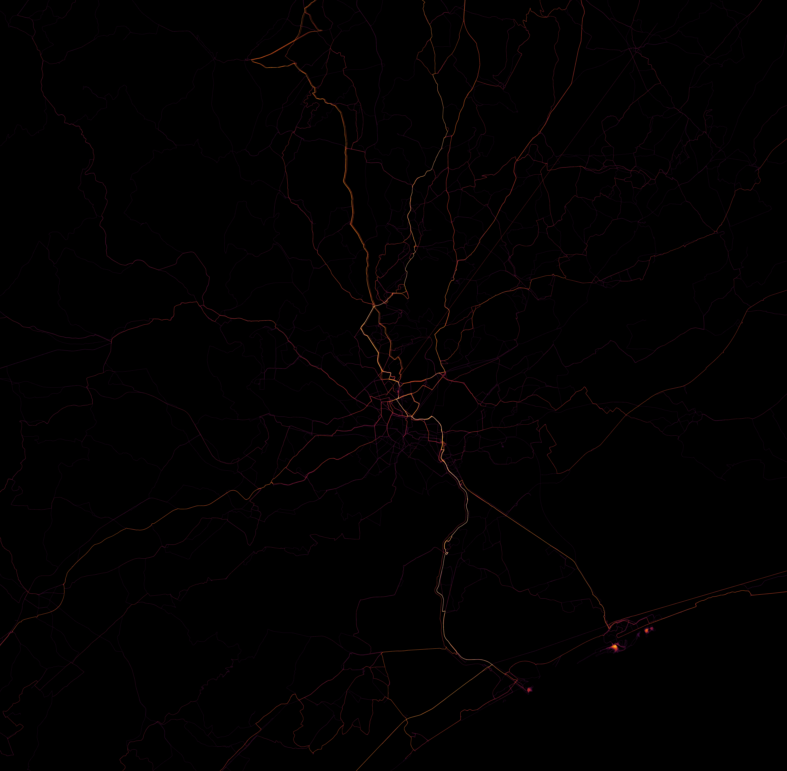
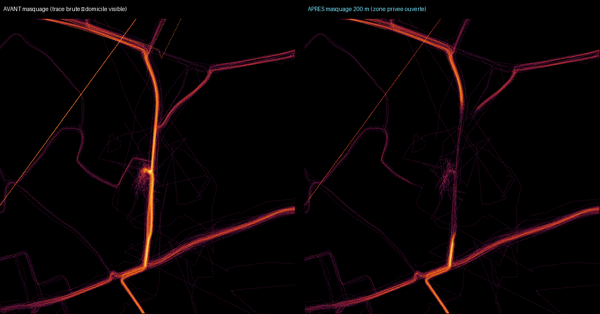

# Raw-trace heatmap — prototype, benchmark & flag-gated implementation

**Status: flag-gated feature, default OFF. Safe to merge — prod behaviour is
byte-identical until `HEATMAP_DISPLAY_SOURCE=raw` is set. NOT a table drop, NOT
a prod flip.** Decision package for Paul.

Date: 2026-07-28. Branch `proto/raw-trace-heatmap`. Measured locally against
the full substrate (`osm_road_edges` 16.4 M / 4.17 GB, `heat_edges` 2.3 M,
`activities` 1888 / 950 heatmap-consented, `osm_ways` 1.2 M). No prod touched,
no table dropped.

## The decision (Paul, 2026-07-21)

Drop K-anonymity + OSM map-matching + the coarse grid. Render **precise RAW GPS
traces** — the Strava raw-raster / law-of-large-numbers look. Privacy is handled
by **masking the start and end of each activity** (protect home / work) instead
of K-anonymity. Precise traces, not a 15 m grid; a fine lattice ≤5 m only where
the render genuinely needs one to rasterize.

## What this PR ships (behind a flag)

| Piece | File | Notes |
|---|---|---|
| Endpoint masking (privacy SSOT) | `backend/app/services/trace_privacy.py` | pure, unit-tested; `TRACE_MASK_METERS` (default 200 m) |
| Raw-trace display build path | `backend/app/services/raw_trace_display.py` | `HEATMAP_DISPLAY_SOURCE=matched\|raw` (default **matched**); `HEATMAP_MIN_USERS` (default **1**) |
| Build-path branch | `backend/app/jobs/build_pmtiles.py` | when `raw`, PMTiles built from masked raw traces; matched path untouched |
| Visual prototype (PNGs) | `backend/app/jobs/proto_raw_trace_heatmap.py` | numpy + PIL raster of the masked traces |
| Tests | `backend/tests/test_trace_privacy_mask.py`, `test_raw_trace_display.py` | masking invariants + flag default + build routing + export shape |

Merging changes **nothing** in prod. Flipping `HEATMAP_DISPLAY_SOURCE=raw` +
one heatmap rebuild switches the display artefact to raw traces.

## Endpoint masking = the privacy mechanism

`trace_privacy.mask_endpoints(coords, mask_m=200)` trims `mask_m` metres
(along-track, interpolating the exact boundary point so the hole is exactly
`mask_m` wide) off the physical start of the first run and the end of the last
run of a trace:

- **There-and-back ride** (start == end == home) → both occurrences of home are
  trimmed, because both polyline ends are trimmed.
- **Track breaks** (`None` sentinels from `_densify_coords`) split the trace
  into runs; only the outer ends are masked, inner ends preserved.
- **Short trace** (total ≤ 2 × mask) → returns `[]` (fully masked, contributes
  nothing).
- Never mutates the stored geometry (Crouzet invariant #1) — operates on a copy.

## Tunable user-count gate `HEATMAP_MIN_USERS` (default 1)

A distinct-user counter on a fine ≤5 m lattice (the lattice is ONLY a privacy
counter — the render stays raw traces). Any segment whose fine cell has fewer
than `HEATMAP_MIN_USERS` distinct contributing users is suppressed from the
built PMTiles.

- **Default 1** — show everything, including solo traces (Paul's current beta
  choice). Output byte-identical to the ungated path (every occupied cell has
  ≥1 user by construction → whole runs survive; the user lattice is not even
  built).
- **Set 2 later** — hides single-user pixels. This is how **"K=1 now → K=2 at
  50 users" becomes a one-env-var flip with no rework.** Measured on the current
  corpus: 949 whole runs at `MIN_USERS=1` → **2950 multi-user sub-segments at
  `MIN_USERS=2`** (only the stretches where ≥2 distinct riders overlapped a fine
  cell survive).
- Endpoint masking is **always on and independent** of this gate — masked-off
  (home) points are trimmed before any counting, so they never count toward
  either popularity or the user gate.
- Applies ONLY in `raw` mode; `matched` mode is untouched.

## The visuals

### 1. Raw-trace heatmap (Hérault / Montpellier, ~5 m, masked)

Same bbox as `docs/img/grid-vs-osm-*.png` (lon 3.70–4.05, lat 43.50–43.75), so
it is directly comparable. 605 activities, 6.1 M densified points accumulated
into a ~5 m raster (5640×5528), Strava-style hot ramp on black.

This reads as the **Strava raw-raster look**: precise thin individual traces,
bright warm corridors where many overlap (the Montpellier N-S spine burns
orange→white), a fine web radiating outward, and the classic straight-diagonal
GPS artifacts. Corridor brightness emerges from overlap density (max overlap on
one 5 m pixel: 106 activities) — the law-of-large-numbers effect, honest even at
this single-user-dominated corpus.

### 2. Endpoint masking — before / after (home-cluster zoom)

Zoom on the densest trace-endpoint cell (the closest thing to "home" in the
corpus), ~800 m box at ~1.5 m/px, unmasked vs masked (200 m).

The bright terminus knot in the left ("AVANT") panel — where traces converge and
end at home — opens into a faint scatter in the right ("APRÈS") panel: the
privacy zone. The through-road spine remains (it is a public road ridden
mid-route), but the concentrated home terminus is gone.

## Ingestion / build cost — trivial (no matching)

No OSM segment load, O(points):

| Step | Cost |
|---|---|
| Parse + endpoint-mask, per activity | **~6 ms** (605 acts in 3.7 s) |
| Parse + mask + raster accumulate, per activity | **~7.6 ms** |
| Full raw PMTiles build (949 acts: parse+mask+density lattice+GeoJSON+tippecanoe) | **44 s total** (~27 ms/act incl. the 212 MB intermediate write) |

Compare to the OSM matcher: **0.07–1.27 s/activity local**, **30 s–3 min/activity
on prod f1-micro** for long multi-region rides (measured 2026-07-21). Raw masking
is in the same O(points) class as the grid prototype (~ms/activity) — the whole
corpus in seconds, no per-activity segment reload, no tier bump.

## DB / storage — same win as grid (routing substrate becomes droppable)

Total DB today: **15 GB**. Raw-trace display needs only `activities` (the raw
traces, already stored, 0.145 GB) + a derived PMTiles served statically from GCS
(not in the DB). Everything below becomes droppable:

| Group | GB | Fate under raw |
|---|---|---|
| `osm_road_edges` (all partitions) | 4.17 | DROP (routing substrate, frozen) |
| `ch_shortcuts` (routing) | 2.84 | DROP |
| `osm_ways` | 0.79 | DROP |
| `dfci_edges` / `trail_edges` | 0.35 | DROP |
| `heat_edges` (+ agg) | 1.53 | DROP once raw soaks |
| `heat_edge_contributors` | 0.93 | DROP with heat_edges |
| `heat_cells` (+ contributors) | 0.24 | DROP (grid path unused) |
| `activities` (RAW TRACES) | 0.145 | **KEEP** — the only source raw needs |

- Immediate (routing substrate, already frozen): **~8.15 GB freed** → 15 → ~6.85 GB.
- After raw soaks and heat_edges/heat_cells go: another ~2.7 GB → **~4.2 GB**.

This is the **same ~8–11 GB / ~50–70 % reduction** the grid prototype reported —
raw is actually **leaner** than grid (it needs no new `heat_cells` table; the
render artefact lives in GCS, not the DB). The table drops are a SEPARATE,
explicitly-gated step — NOT in this PR.

## How the display works in prod (and how to flip)

Today (`matched`): ingest → `heat_edges` → incremental `heat_edges_agg` → static
`heatmap-display.pmtiles` (built from the agg via `heat_aggregation` SSOT) →
served from GCS + a live MVT fallback.

Under `raw`: `build_pmtiles` reads **community-eligible** consented `activities`
(provenance gate `source='manual_upload'` — SSOT `provenance.is_community_source`;
`strava_api` + legacy `NULL` are excluded, same rule the matched pipeline gates
at ingest), masks endpoints, and emits the masked polylines as `LineString`
features in the same `trails` layer
with the same props (`sport` / `user_count` / `pass_count` / `heat_score` /
`highway_type`). The existing frontend (`community-heatmap-layers.ts`) renders it
**with no change** — verified by decoding the produced PMTiles. A fine ≤5 m
density lattice is used ONLY to compute `heat_score` (so busy corridors burn
brighter through the existing ramp); the drawn geometry is the real, precise
masked GPS polyline, never snapped to the lattice. `heat_edges_agg` and the live
MVT become irrelevant in `raw` mode.

**Flip to raw in prod (when Paul says go):** the exact staged, reversible-where-
possible, Paul-gated procedure is in **`docs/raw-trace-cutover-runbook.md`**. In
short: set `HEATMAP_DISPLAY_SOURCE=raw` + `HEATMAP_MIN_USERS=1` on the
services + build job, one rebuild, validate, reword consent, and ONLY THEN drop
the (frozen) routing substrate for the DB-size win.

## Honest tradeoffs

- **Privacy posture changes fundamentally.** K-anonymity guaranteed no single
  edge was traceable to <K riders. Raw mode at `HEATMAP_MIN_USERS=1` draws
  **individual mid-route traces** — a rider's exact path between the masked ends
  is visible; endpoint masking protects **home/work only**, not the route.
  `HEATMAP_MIN_USERS=2` restores per-cell K=2 (a segment shows only where ≥2
  riders overlap) — the K=1→K=2 flip is now a one-env-var change (see the gate
  section). Note this is **cell-K, not route-K** (an individual's distinct route
  line still draws where its cells clear the gate), and endpoint masking does
  NOT cover a home passed **mid-route**. Decide the target model + timing
  explicitly before any public launch (tracked in the cutover runbook).
- **Consent wording must change — REQUIRED cutover prerequisite.** The current
  consent copy says the data is "anonymisées" (K-anonymity). Raw traces with
  endpoint masking are NOT anonymised in that sense. The consent string (and
  likely the ODbL export description) MUST be reworded — e.g. "vos traces
  précises, début et fin masqués" — **before** flipping `HEATMAP_DISPLAY_SOURCE=raw`
  for real users. Deliberately NOT changed in code here (legal wording is Paul's
  call at cutover); tracked as step (e) in `docs/raw-trace-cutover-runbook.md`.
- **Routing dies for good.** `.fgraph` is built from OSM topology; dropping the
  substrate makes routing permanently dead (already frozen — this makes it
  irreversible). The true strategic cost.
- **Per-segment vector exports gone.** gpx.studio "popular segments" degrades to a
  raw-trace ODbL export.
- **GPS noise is retained** (no matcher to discard it) — accepted, it is part of
  the Strava look.

## My honest read

The full-bbox raster **does** look like the Strava LLN heatmap Paul wants:
precise traces, bright overlap corridors, the raw-raster texture. Endpoint
masking demonstrably opens a privacy zone at home. Ingestion is trivial and the
storage win matches the grid plan while being leaner. The blocker is not
technical — it is the **privacy-model + consent decision** (individual traces
visible; "anonymised" wording no longer true) and the **irreversible loss of
routing**. Those are Paul's calls. Ship the flag; decide the model before
flipping prod.

**Not for merge-as-a-flip.** Merge is safe (default off, prod unchanged); the
`HEATMAP_DISPLAY_SOURCE=raw` flip + the table drops are separate, deliberate,
Paul-gated steps.
